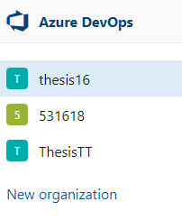
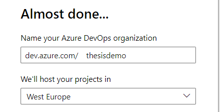
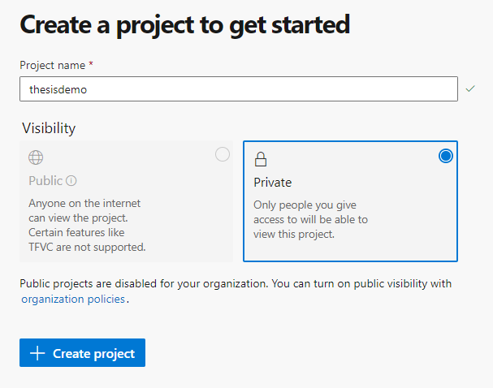

# Thesis - Create CI (Continuous Integration) environment for Embedded System

## Table of Contents
<!-- TOC -->
- [Create a project in Azure DevOps](#create-a-project-in-azure-devops)  
- [Clone code into reposiotry](#clone-code-into-repository)  
- [Integrate with AB](#)  
- [Generate and build Pipeline in Azure](#)  
- [Perform an automatic Pipeline](#)  
<!-- TOC -->

## Create a project in Azure DevOps
- To build this envrionment, first, you need to create and login into Azure Devops.  

  
- Pick and name and `+ Create project`  
  
## Clone code into repository
- You can use either Azure Git repository or Github Repo 
```bash
$git clone https://github.com/quanghoang72/RTOS-pipeline.git
```