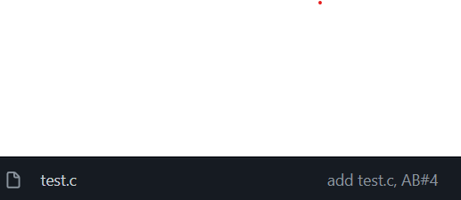
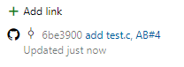
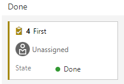
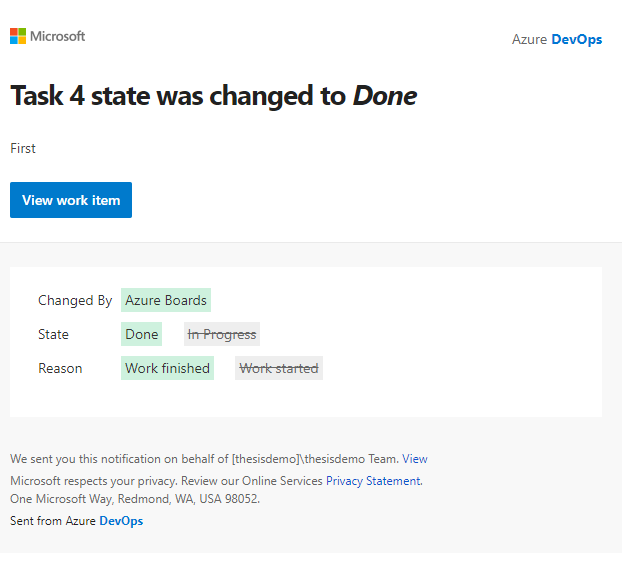
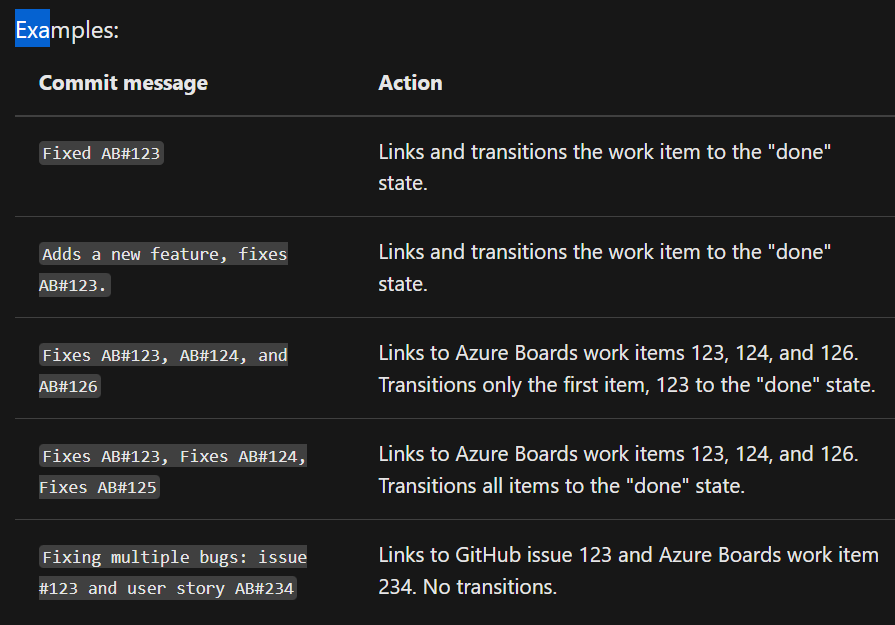
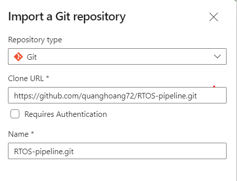

# Thesis - Create CI (Continuous Integration) environment for Embedded System

## Table of Contents
<!-- TOC -->
- [Create a project in Azure DevOps](#create-a-project-in-azure-devops)  
- [Integrate with AB](#)  
- [Clone code into reposiotry](#clone-code-into-repository)  
- [Generate and build Pipeline in Azure](#)  
- [Perform an automatic Pipeline](#)  
<!-- TOC -->

## Create a project in Azure DevOps
To build this envrionment, first, you need to create and login into Azure Devops.  

  
Pick and name and `+ Create project`  
  
## Integrate with AB (Azure Boards)
To connect between the Azure Board and Github repo  
- `Project setting` > `Github Connections` > `Authorize AzureBoards` > Chose your desired project for this Repo > `Save` > `Approve, Install, & Authorize`  
- Create a task in AB > check for the task ID  
- Develop the code, commit as this syntax,this will link to the workitem ID  
```bash
AB#{ID}
```  

  
- To change state to done state, use syntax `Fix AB#{ID}` in commit message  
- In this project, I create new subscription to notify when the task change state (in this case from `In Progress` > `Done`)  

  
  
  

## Clone code into repository
You can use either Azure Git repository or Github Repo
- #### Azure Git Repository
Import a repository by copy paste url  

```bash
$git clone https://github.com/quanghoang72/RTOS-pipeline.git
```